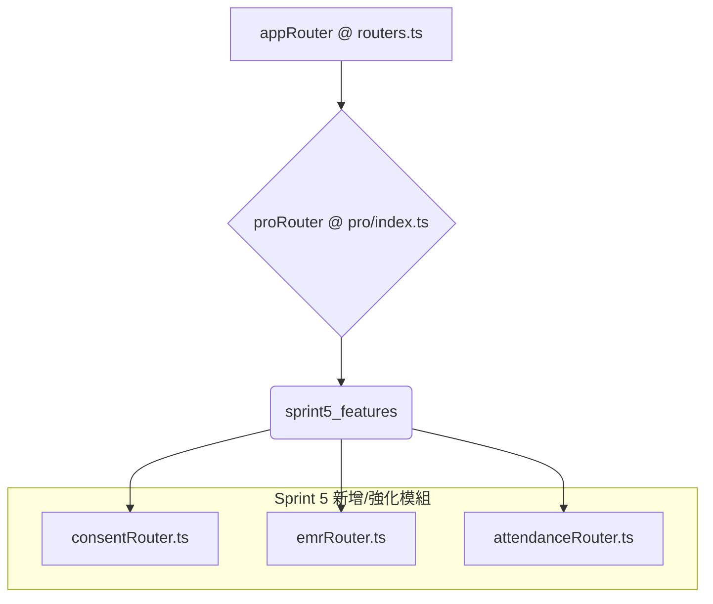

# FLOS 功能模組整合架構分析與開發計畫

## 1. 專案背景與目標

本文件旨在規劃將 FLOS 診所系統的核心功能模組（知情同意書、EMR、智慧打卡）整合至 YOKAGE 高配版 SaaS 平台的技術架構與實施路徑。目標是在不影響現有 Sprint 4 開發的前提下，以獨立、模組化的方式完成新功能開發，並在最後階段無縫整合至主幹。

## 2. 現有架構分析

經過對 `CHiLL106699/YOKAGE` repo 的初步分析，我們掌握了當前的技術堆疊與架構模式：

| 層級 | 技術/元件 | 說明 |
| :--- | :--- | :--- |
| **前端** | React, TypeScript, Vite | 現代化的前端開發框架與工具鏈。 |
| | Tailwind CSS, Radix UI | 高效的 CSS 框架與無頭 UI 元件庫，已建立豐富的 `components/ui`。 |
| | `@tanstack/react-query` | 用於 API 狀態管理與快取，符合效能優化要求。 |
| | `wouter` | 輕量級的路由解決方案。 |
| | `React.lazy` + `Suspense` | `App.tsx` 中已大規模採用，實現頁面級的代碼分割。 |
| **後端** | Node.js, Express, tRPC | 提供類型安全的 API 開發體驗，前端與後端緊密整合。 |
| **資料庫** | PostgreSQL, Drizzle ORM | 類型安全的 ORM，透過 `drizzle/schema.ts` 管理資料庫結構。 |
| **核心結構** | `server/routers.ts` | 主路由檔案，透過 `appRouter` 聚合所有子路由。 |
| | `server/db.ts` | 統一的資料庫操作層，封裝了所有 SQL 查詢。 |

**現有模組狀態：**

- **知情同意書 (`consentRouter`)**: 已存在基礎的 CRUD 功能與對應的 `consentFormTemplates`、`consentSignatures` 資料表，可在此基礎上擴充。
- **電子病歷 (`emrRouter`)**: 存在於 `proRouter` 中，但為 Placeholder 實現，需進行完整開發。`treatmentRecords` 和 `treatmentPhotos` 資料表已為 EMR 提供了良好的基礎。
- **智慧打卡 (`attendanceRouter`)**: 功能已相對完善，包含打卡、記錄查詢等。`attendanceRecords` 資料表結構完整，支援補打卡與審核流程。

## 3. 開發策略與資料流向

為遵循「避免修改共用檔案」的原則，我們將採用「獨立開發，後期整合」的策略。

### 3.1. 後端 (tRPC Routers)

我們將在 `server/routers/` 目錄下建立一個新的子目錄 `sprint5/` 來存放本次開發的所有新 Router，以確保與現有邏輯的物理隔離。



- **`sprint5/consentRouter.ts`**: 擴充現有 `consent` 功能，增加模板版本控制、簽署流程的 PDF 生成與預覽邏輯。
- **`sprint5/emrRouter.ts`**: 完整實作 EMR 功能，包括病歷 CRUD、圖片上傳（利用 `server/storage.ts`）、以及 Before/After 圖片關聯查詢。
- **`sprint5/attendanceRouter.ts`**: 強化現有打卡功能，增加月統計資料聚合、補打卡申請與審核流程的 API 端點。

### 3.2. 前端 (React Components & Pages)

所有新頁面將在 `client/src/pages/dashboard/` 和 `client/src/pages/staff/` 下建立，並使用 `React.lazy` 進行異步加載。

```mermaid
graph TD
    A[App.tsx] --> B{DashboardLayout}
    A --> C{StaffLayout}

    subgraph Dashboard Routes
        B --> D[/dashboard/consent-templates]
        B --> E[/dashboard/emr]
        B --> F[/dashboard/emr/:id]
    end

    subgraph Staff Routes
        C --> G[/staff/clock]
        C --> H[/staff/attendance]
        C --> I[/staff/attendance-request]
    end
```

- **資料流**: 所有前端頁面將透過 `trpc` 客戶端實例 (`client/src/lib/trpc.ts`) 呼叫對應的後端 Router。React Query 的 `useQuery` 和 `useMutation` 將被用來處理資料獲取、快取與狀態更新，確保 UI 的響應性與數據一致性。
- **圖片上傳**: 將封裝一個 `useUpload` hook，內部調用 `server/storage.ts` 提供的預簽章 URL (Presigned URL) 功能，實現前端直傳 S3，避免伺服器中轉，降低後端負載。

## 4. 預計修改與新增檔案清單

| 類型 | 路徑 | 說明 |
| :--- | :--- | :--- |
| **新增 (Backend)** | `server/routers/sprint5/consentRouter.ts` | 知情同意書 CRUD、簽署、PDF 生成。 |
| | `server/routers/sprint5/emrRouter.ts` | EMR CRUD、圖片上傳、BA 照查詢。 |
| | `server/routers/sprint5/attendanceRouter.ts` | 打卡月統計、補打卡申請/審核。 |
| | `drizzle/schema_sprint5.ts` | (如果需要) 新增 EMR 或同意書相關的擴充欄位。 |
| **修改 (Backend)** | `server/routers/pro/index.ts` | 引入並掛載 `sprint5` 的 routers。 |
| | `server/db.ts` | 新增對應新功能的資料庫查詢函式。 |
| **新增 (Frontend)** | `client/src/pages/dashboard/ConsentTemplatePage.tsx` | 同意書模板管理介面。 |
| | `client/src/pages/dashboard/EmrListPage.tsx` | EMR 病歷列表。 |
| | `client/src/pages/dashboard/EmrDetailPage.tsx` | EMR 病歷詳情與 BA 照比對。 |
| | `client/src/pages/staff/AttendanceCalendarPage.tsx` | 員工出勤月曆視圖。 |
| | `client/src/pages/staff/AttendanceRequestPage.tsx` | 補打卡/加班申請頁面。 |
| | `client/src/components/SignaturePad.tsx` | 簽名板元件。 |
| | `client/src/components/BeforeAfterSlider.tsx` | BA 照滑桿比對元件。 |
| | `client/src/hooks/useUpload.ts` | 封裝 S3 上傳邏輯。 |
| **修改 (Frontend)** | `client/src/App.tsx` | 在最後階段加入新頁面的路由。 |
| | `client/src/pages/staff/StaffClock.tsx` | 強化現有打卡頁面，整合 GPS。 |
| **新增 (Docs)** | `PRODUCTION_CHECKLIST.md` | 生產環境部署檢查清單。 |

## 5. 開發計畫與驗收

本計畫將依循您設定的階段性交付原則，分階段進行開發與驗收。

- **Phase 3: 後端實作**: 完成所有 `sprint5` 子路由的邏輯與資料庫操作。
- **Phase 4: 前端實作**: 開發所有新頁面與元件，並與後端 API 對接。
- **Phase 5 & 6: 優化與測試**: 進行效能優化、完成 Production 就緒檢查，並執行 `tsc --noEmit` 與 `pnpm build` 確保零錯誤。
- **Phase 7: 整合與報告**: 將新路由與頁面整合至主應用，Push 至 `main` 分支，並提交最終報告。

此架構設計確保了開發過程的獨立性與低耦合，最大程度地降低了對現有開發工作的干擾，並為最終的順利整合奠定了基礎。請審核此計畫，若無異議，我將開始執行 Phase 3 的後端開發工作。
