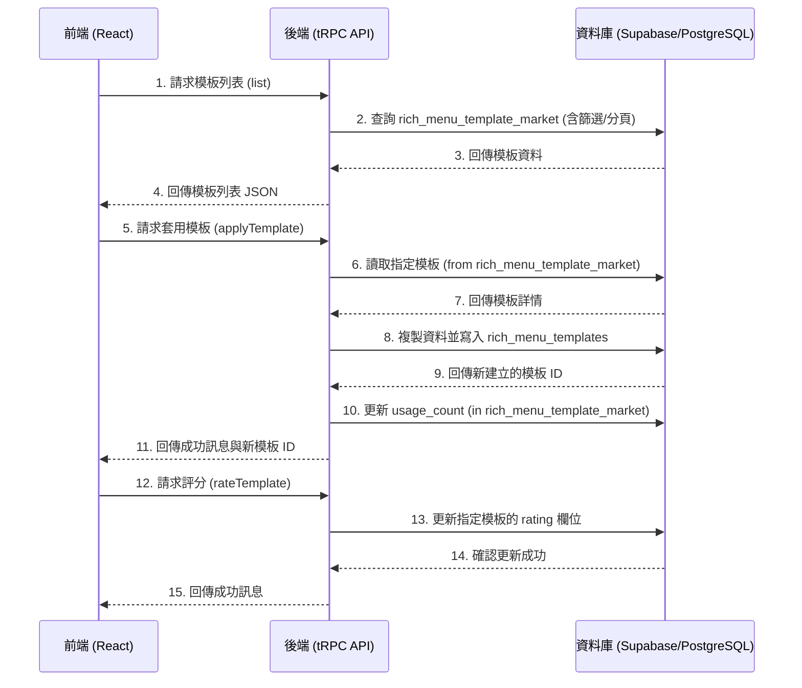

# Phase 109: Rich Menu 模板市集 - 架構分析與實作計畫

**作者**：Manus AI
**日期**：2026年2月16日

---

## 1. 專案目標

本次任務 (Phase 109) 的核心目標是為 YOChiLL SaaS 平台建立一個「Rich Menu 模板市集」。此功能將允許使用者瀏覽、預覽、評分並一鍵套用預製的 Rich Menu 模板，從而簡化 Rich Menu 的創建流程，提升使用者體驗。

## 2. 架構分析

遵循專案既有的技術棧 (tRPC, Drizzle ORM, React, TypeScript, shadcn/ui) 與開發模式，本次實作將分為後端 API 層與前端 UI 層。

### 2.1 後端架構 (tRPC + Drizzle)

後端將建立一個新的 tRPC Router (`richMenuTemplateMarketRouter`) 來處理所有與模板市集相關的邏輯，確保業務邏輯的封裝與資安。

- **資料庫 Schema**：將使用已存在的 `rich_menu_template_market` 資料表作為主要資料來源，並在「套用模板」功能中，將資料寫入 `rich_menu_templates` 資料表。
- **API 程序 (Procedures)**：所有程序將使用 `protectedProcedure`，確保只有登入的使用者可以存取。
- **錯誤處理**：將使用 `TRPCError` 來處理如「模板不存在」等預期錯誤，並回傳標準化的錯誤訊息給前端。
- **資料庫操作**：所有資料庫互動將透過 Drizzle ORM 進行，並遵循 `.returning()` 模式以取得新插入的資料，減少額外的查詢。

### 2.2 前端架構 (React + TypeScript)

前端將建立一個新的頁面元件 (`RichMenuTemplateMarket.tsx`)，並整合至現有的儀表板中。

- **狀態管理與資料獲取**：將使用 `@tanstack/react-query` (透過 `trpc.useQuery` 和 `trpc.useMutation` hooks) 來管理伺服器狀態，包括模板列表的獲取、快取、以及套用/評分等操作。
- **UI 元件庫**：將全面採用專案已導入的 `shadcn/ui` 元件庫，例如 `Card` (模板卡片)、`Dialog` (詳情彈窗)、`Button`、`Input` (搜尋)、`Select` (分類篩選) 等，以維持 UI 風格的一致性。
- **路由管理**：將使用 `wouter` 在 `App.tsx` 中註冊新的路由 `/dashboard/rich-menu/market`。
- **使用者體驗**：
  - 將使用 `Skeleton` 元件作為載入中的佔位符，提升感知效能。
  - 使用 `use-debounce` hook 來處理搜尋輸入，避免過於頻繁的 API 請求。
  - 評分功能將使用 `lucide-react` 的 `Star` 圖示來實現。

## 3. 資料流向圖

## 4. 預計修改/新增的檔案清單

| 類型 | 路徑 | 說明 |
| :--- | :--- | :--- |
| **新增 (後端)** | `server/routers/richMenuTemplateMarket.ts` | 核心 tRPC Router，包含模板市集所有 API 邏輯。 |
| **修改 (後端)** | `server/routers.ts` | 註冊新的 `richMenuTemplateMarketRouter`。 |
| **新增 (前端)** | `client/src/pages/dashboard/RichMenuTemplateMarket.tsx` | 模板市集主頁面，包含網格展示、篩選、搜尋功能。 |
| **新增 (前端)** | `client/src/components/Rating.tsx` | 可重複使用的星級評分元件。 |
| **修改 (前端)** | `client/src/App.tsx` | 新增模板市集頁面的路由。 |
| **修改 (前端)** | `client/src/pages/dashboard/RichMenuManagement.tsx` | 新增「從模板市集選擇」的入口按鈕，導向新頁面。 |
| **新增 (資料庫)** | `drizzle/seed-market.ts` | (可選) 用於填充模板市集初始資料的腳本。 |

---

此架構設計已完成，待 Tech Lead 批准後即可進入開發階段。
