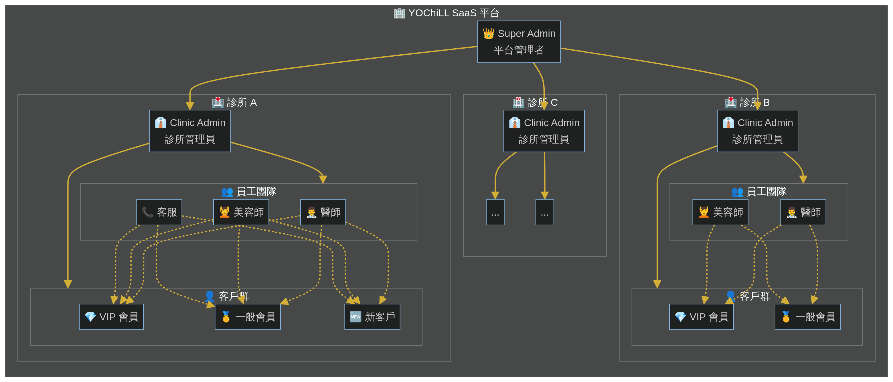
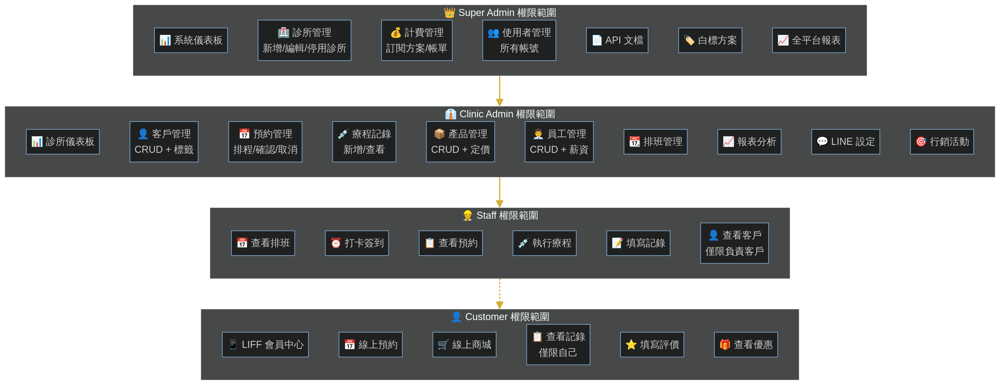
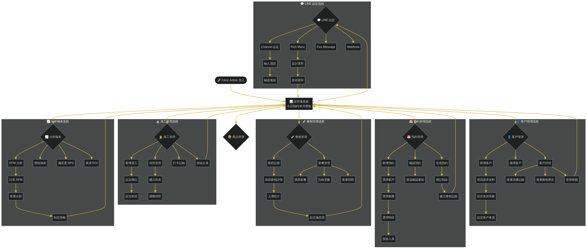
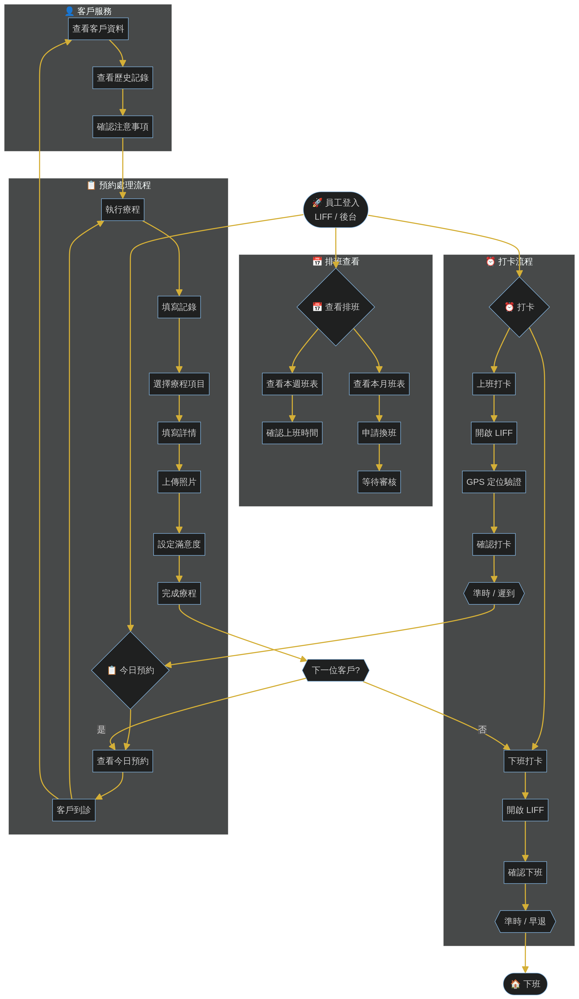
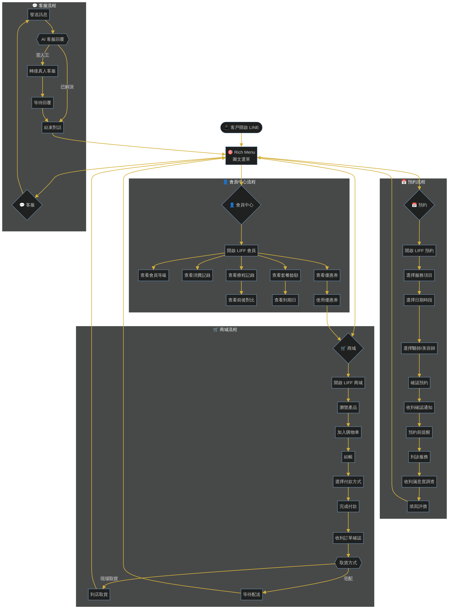
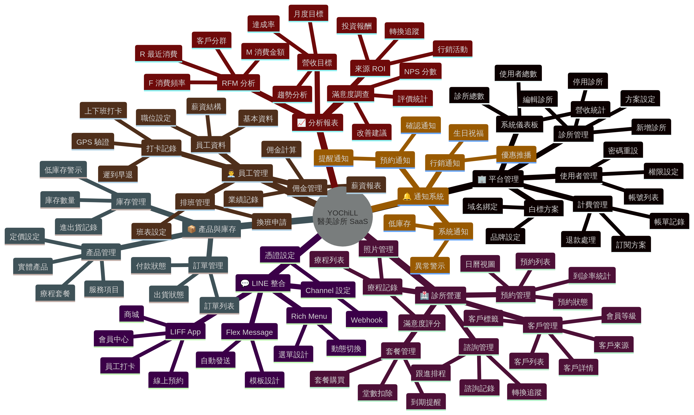
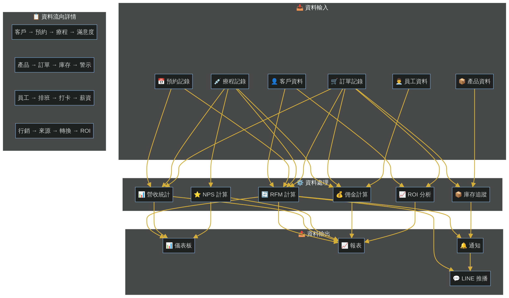

# YOChiLL SaaS 平台架構圖與流程圖

> **版本**：v1.0  
> **最後更新**：2026-01-17  
> **適用對象**：SaaS 平台設計者、系統架構師

---

## 目錄

1. [SaaS 平台層級架構圖](#1-saas-平台層級架構圖)
2. [角色權限層級圖](#2-角色權限層級圖)
3. [Super Admin 操作流程圖](#3-super-admin-操作流程圖)
4. [Clinic Admin 操作流程圖](#4-clinic-admin-操作流程圖)
5. [Staff 員工操作流程圖](#5-staff-員工操作流程圖)
6. [Customer 客戶操作流程圖](#6-customer-客戶操作流程圖)
7. [功能模組心智圖](#7-功能模組心智圖)
8. [資料流向圖](#8-資料流向圖)

---

## 1. SaaS 平台層級架構圖

此圖展示 YOChiLL SaaS 平台的多租戶架構，從平台管理者到各診所、員工、客戶的層級關係。



**層級說明**：

| 層級 | 角色 | 說明 |
|------|------|------|
| L0 | Super Admin | 平台最高管理者，管理所有診所 |
| L1 | Clinic Admin | 診所管理員，管理單一診所 |
| L2 | Staff | 診所員工（醫師、美容師、客服） |
| L3 | Customer | 診所客戶（VIP、一般、新客） |

**資料隔離**：
- 每個診所的資料完全隔離
- 員工只能存取所屬診所的資料
- 客戶只能存取自己的資料

---

## 2. 角色權限層級圖

此圖展示各角色的權限範圍與可操作功能。



**權限繼承關係**：
```
Super Admin → Clinic Admin → Staff → Customer
（權限由上至下遞減）
```

---

## 3. Super Admin 操作流程圖

此圖展示平台管理者的日常操作流程。


**主要職責**：
1. **診所管理**：新增、編輯、停用診所
2. **計費管理**：訂閱方案、帳單、退款
3. **使用者管理**：帳號、權限、密碼重設
4. **報表分析**：全平台營收、活躍度、成長趨勢

---

## 4. Clinic Admin 操作流程圖

此圖展示診所管理員的完整操作流程。



**主要職責**：
1. **客戶管理**：新增、搜尋、標籤、會員等級
2. **預約管理**：新增、確認、完成、取消
3. **療程管理**：記錄、照片、滿意度、套餐
4. **員工管理**：新增、排班、打卡、佣金
5. **分析報表**：RFM、營收、NPS、ROI
6. **LINE 設定**：Channel、Rich Menu、Flex Message

---

## 5. Staff 員工操作流程圖

此圖展示診所員工的日常工作流程。



**日常流程**：
1. **上班打卡**：LIFF 打卡 + GPS 驗證
2. **查看排班**：確認今日班表
3. **處理預約**：客戶到診 → 執行療程 → 填寫記錄
4. **下班打卡**：確認下班

---

## 6. Customer 客戶操作流程圖

此圖展示客戶透過 LINE 使用系統的完整流程。



**使用流程**：
1. **預約**：選擇服務 → 選擇時段 → 確認預約
2. **會員中心**：查看等級、記錄、套餐、優惠券
3. **商城**：瀏覽 → 加入購物車 → 結帳
4. **客服**：發送訊息 → AI 回覆 / 轉接真人

---

## 7. 功能模組心智圖

此圖展示系統所有功能模組的樹狀結構。



**七大功能區塊**：

| 區塊 | 主要功能 |
|------|----------|
| 🏢 平台管理 | 系統儀表板、診所管理、計費管理、使用者管理、白標方案 |
| 🏥 診所營運 | 客戶管理、預約管理、療程記錄、套餐管理、諮詢管理 |
| 📦 產品與庫存 | 產品管理、庫存管理、訂單管理 |
| 👨‍💼 員工管理 | 員工資料、排班管理、打卡記錄、佣金管理 |
| 📈 分析報表 | RFM 分析、營收目標、滿意度調查、來源 ROI |
| 💬 LINE 整合 | Channel 設定、Rich Menu、Flex Message、LIFF App |
| 🔔 通知系統 | 預約通知、行銷通知、系統通知 |

---

## 8. 資料流向圖

此圖展示系統各模組之間的資料流向與串接關係。



**核心資料流**：

| 資料流 | 說明 |
|--------|------|
| 客戶 → 預約 → 療程 → 滿意度 | 客戶服務主流程 |
| 產品 → 訂單 → 庫存 → 警示 | 商品銷售流程 |
| 員工 → 排班 → 打卡 → 薪資 | 人事管理流程 |
| 行銷 → 來源 → 轉換 → ROI | 行銷分析流程 |

---

## 附錄：圖表原始檔

所有圖表的 Mermaid 原始檔位於 `docs/diagrams/` 目錄：

| 檔案 | 說明 |
|------|------|
| `saas-hierarchy.mmd` | SaaS 平台層級架構圖 |
| `role-permissions.mmd` | 角色權限層級圖 |
| `flow-super-admin.mmd` | Super Admin 操作流程圖 |
| `flow-clinic-admin.mmd` | Clinic Admin 操作流程圖 |
| `flow-staff.mmd` | Staff 員工操作流程圖 |
| `flow-customer.mmd` | Customer 客戶操作流程圖 |
| `feature-mindmap.mmd` | 功能模組心智圖 |
| `data-flow.mmd` | 資料流向圖 |

可使用 `manus-render-diagram` 工具重新渲染圖表。

---

*架構圖文檔 - YOChiLL 醫美診所 SaaS 平台*
