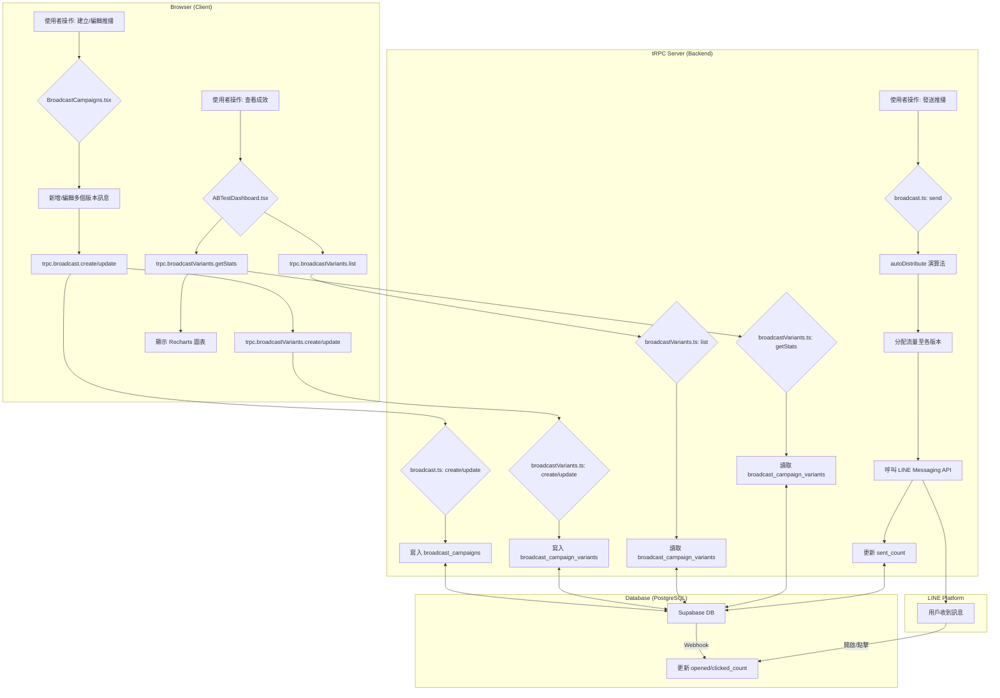

# Phase 110 & 111: 推播系統 A/B 測試功能開發計畫

**日期**: 2026年2月16日

**版本**: 1.0

**負責人**: Manus

---

## 1. 總體目標

為 YOChiLL SaaS 平台的推播系統實作 A/B 測試功能。此功能將允許使用者為單一推播活動（Campaign）建立多個訊息版本（Variants），設定不同流量比例，並透過數據儀表板比較各版本成效（開啟率、點擊率、轉換率），最終選出或自動分配最佳版本，以優化行銷訊息的轉換效益。

此計畫遵循「文檔驅動開發」原則，本文件為開發前之架構分析、資料流向與修改檔案清單，待批准後方可進入編碼階段。

## 2. 架構分析

為符合現有 tRPC + Drizzle ORM 的技術棧，並確保程式碼的可維護性與擴展性，本次開發將分為後端 API 擴充與前端儀表板整合兩大部分。

### 2.1 後端架構 (Phase 110)

我們將在 `server/routers/` 目錄下新增一個專門處理 A/B 測試版本的 tRPC 路由器：`broadcastVariants.ts`。將其作為一個獨立的子路由器，有以下優點：

- **關注點分離 (Separation of Concerns)**：將版本管理的邏輯（CRUD、統計）與主推播活動的邏輯解耦。
- **避免循環依賴**：`broadcast.ts` 中已存在 `broadcastRouter.createCaller` 的自我調用，新增獨立的 router 可避免加劇此問題。

主要的後端修改如下：

1.  **建立 `broadcastVariants.ts`**: 此檔案將包含所有與 `broadcast_campaign_variants` 資料表相關的 API。
2.  **擴充 `broadcast.ts`**: 修改現有的 `create` 和 `send` API，以整合 A/B 測試的邏輯。
3.  **註冊新路由**: 在 `server/routers.ts` 中註冊新的 `broadcastVariantsRouter`。

### 2.2 前端架構 (Phase 111)

前端修改將集中在 `client/src/pages/dashboard/BroadcastCampaigns.tsx` 檔案，並可能建立一個新的子組件 `ABTestDashboard.tsx` 來處理 A/B 測試的 UI 邏輯，以保持主檔案的整潔。

1.  **UI/UX 整合**: 在建立/編輯推播活動的表單中，新增動態增減訊息版本（Variant）的介面。
2.  **狀態管理**: 使用 React `useState` 來管理多個版本的表單資料。
3.  **數據可視化**: 引入 `recharts` 套件，在活動列表中或詳情頁中，以長條圖或表格形式呈現各版本的成效對比。
4.  **API 整合**: 使用 `trpc` hooks (`useQuery`, `useMutation`) 來呼叫後端新增的 A/B 測試相關 API。

## 3. 資料流向圖

## 4. 預計修改/新增的檔案清單

### Phase 110 (後端)

| 檔案路徑 | 修改/新增 | 摘要說明 |
| :--- | :--- | :--- |
| `server/routers/broadcastVariants.ts` | **新增** | 核心檔案。包含版本 CRUD、列表、統計等 API (`createVariant`, `updateVariant`, `deleteVariant`, `listVariants`, `getVariantStats`)。 |
| `server/routers/broadcast.ts` | **修改** | 1. 修改 `create` API，使其能接收多個版本資料並調用 `broadcastVariantsRouter`。 2. 修改 `send` API，加入 `autoDistribute` 和 `selectWinner` 的邏輯（初期先實現隨機分配）。 |
| `server/routers.ts` | **修改** | 註冊新的 `broadcastVariantsRouter` 到主 `appRouter` 中。 |
| `drizzle/schema.ts` | *無需修改* | `broadcast_campaign_variants` 資料表已存在。 |

### Phase 111 (前端)

| 檔案路徑 | 修改/新增 | 摘要說明 |
| :--- | :--- | :--- |
| `client/src/pages/dashboard/BroadcastCampaigns.tsx` | **修改** | 1. 修改建立/編輯活動的 Dialog，允許動態新增/刪除訊息版本 UI。 2. 在活動列表卡片中，新增顯示 A/B 測試狀態的 Badge。 3. 新增一個按鈕或區塊，用於觸發展開 A/B 測試儀表板。 |
| `client/src/components/dashboard/ABTestDashboard.tsx` | **新增** | (建議) 建立獨立組件，用於顯示 A/B 測試的詳細資訊，包含：版本列表、成效對比圖表 (`recharts`)、最佳版本標示、手動選擇贏家等功能。 |
| `client/src/lib/trpc.ts` | *無需修改* | tRPC 的類型推斷會自動包含新的 router。 |

## 5. 驗收清單 (Checklist)

### 後端 (Phase 110)

- [ ] `broadcastVariantsRouter` 已建立並包含 `create`, `update`, `delete`, `list`, `getStats` API。
- [ ] 所有 API 皆有 Zod 進行輸入驗證。
- [ ] `broadcastRouter.create` 能成功建立一個帶有多個版本的推播活動。
- [ ] `broadcastRouter.send` 能根據版本設定的流量百分比，隨機（或加權）分配訊息給目標客戶。
- [ ] `getVariantStats` 能正確計算並回傳各版本的開啟率、點擊率、轉換率。

### 前端 (Phase 111)

- [ ] 在建立推播活動時，可以新增至少兩個訊息版本（A/B）。
- [ ] 每個版本可以獨立設定訊息內容與流量百分比。
- [ ] 流量百分比總和會自動驗證是否為 100%。
- [ ] 在活動列表中，可以清楚看到哪些活動正在進行 A/B 測試。
- [ ] 可以展開查看 A/B 測試儀表板，其中包含 `recharts` 繪製的成效對比圖表。
- [ ] 系統能根據成效數據，自動標示出表現最佳的版本。
- [ ] 提供手動「選擇最佳版本」並結束 A/B 測試的功能。

---

**請 Tech Lead 審核此開發計畫。若批准，請回覆「Approved」，我將立即開始 Phase 110 的後端開發。**
